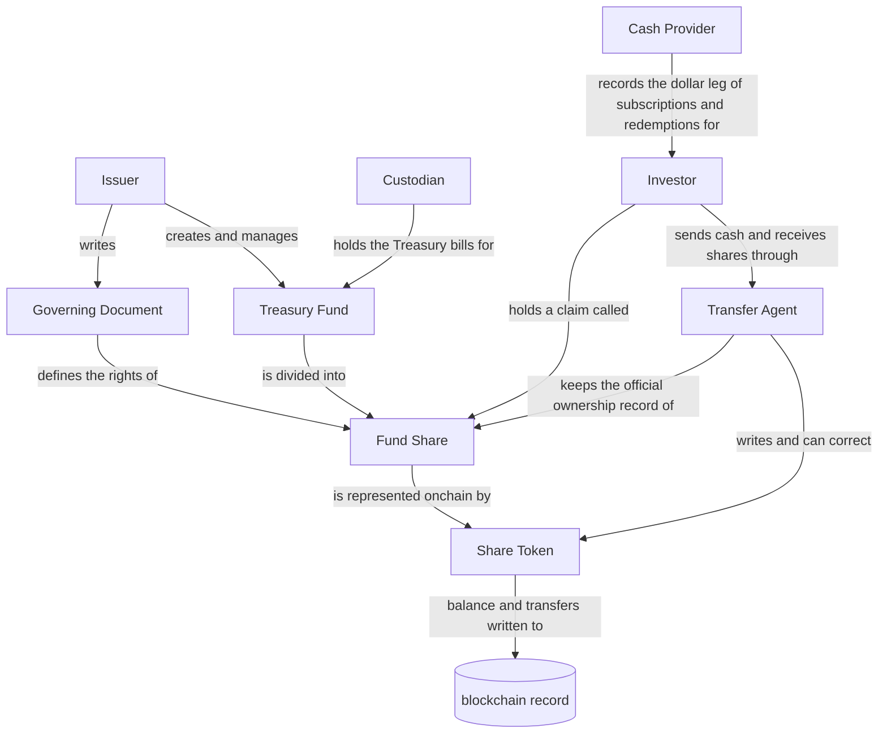

# Week 1 tokenization map

The ten boxes are declared for you so Mermaid syntax is not the exercise.
Drawing the arrows is the exercise.

Rules from `course/week-01/README.md`:

- every arrow needs a label that says what the relationship IS;
- the Share Token points at the Fund Share as a representation of it;
- the Share Token must NOT point at the Treasury Fund's assets as if it were them.

Replace the TODO list with real edges, then delete the TODO list.

## What the map says

- The Share Token points at the Fund Share, not at the Treasury Fund. The
  token records the claim; it is not the bills.
- Two records touch the Fund Share: the Transfer Agent's file and the
  chain. The Transfer Agent is the Authoritative Record in this model, which
  is why it can correct the token.
- Custodian and Cash Provider sit entirely offchain. Nothing on the chain
  can confirm what they report.
