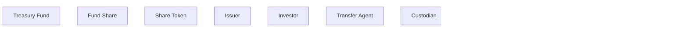

# Week 1 tokenization map

The ten boxes are declared for you so Mermaid syntax is not the exercise.
Drawing the arrows is the exercise.

Rules from `course/week-01/README.md`:

- every arrow needs a label that says what the relationship IS;
- the Share Token points at the Fund Share as a representation of it;
- the Share Token must NOT point at the Treasury Fund's assets as if it were them.

Replace the TODO list with real edges, then delete the TODO list.

## Edges I still owe

- [ ] Issuer to Treasury Fund
- [ ] Issuer to Governing Document
- [ ] Governing Document to Fund Share
- [ ] Treasury Fund to Fund Share
- [ ] Investor to Fund Share
- [ ] Fund Share to Share Token
- [ ] Share Token to blockchain record
- [ ] Transfer Agent to Fund Share
- [ ] Custodian to Treasury Fund
- [ ] Cash Provider to Investor

## Check before you call it done

- [ ] A stranger can follow the arrows without me talking.
- [ ] No arrow implies the token IS a Treasury security.
- [ ] Every offchain box is visibly offchain.
- [ ] I can point at the box that is the Authoritative Record.
